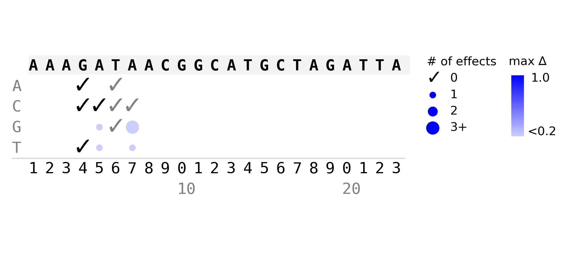
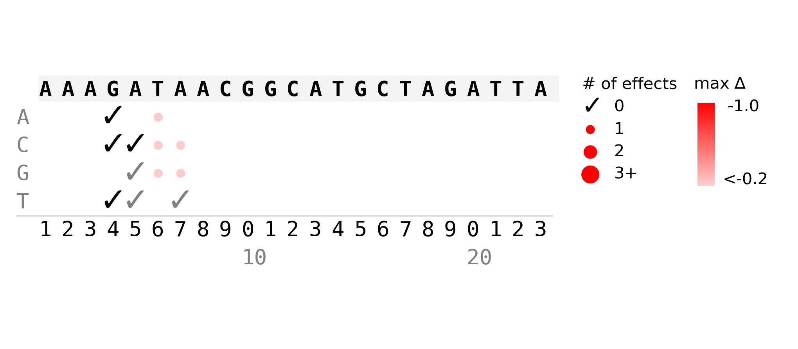

# tfsites.PerturbTfSiteWithoutSideEffects v1

**Author(s):** Joe Solvason, Simran Jandu 

**Contact:** Joe Solvason (solvason@ucsd.edu)

**Adapted as a GenePattern Module by:** Ted Liefeld (jliefeld@cloud.ucsd.edu)

**Task Type:** Transciption factor analysis

**LSID:**  urn:lsid:genepattern.org:module.analysis:00480


## Introduction

Often researchers want to assess functionality of a TF binding site by ablating the site, or assess the role on affinity/score by optimizing or reducing the affinity/score of the site. It is important to ensure that the chosen mutation does not have any unintended side effects. For example, a mutation that ablates your site of interest could also create a binding site that didn’t exist in the original sequence. This tool enumerates all mutations that either ablate a site, optimize the affinity/score of a site, or reduce the affinity/score of a site. For each mutation, it reports any secondary effects on other TF binding sites the mutation has. The best mutation is one that has the intended effect (ablation or optimization) with minimal side effects. This module can also be used to ensure PAM deletions for CRISPR experiments do not alter existing binding sites.

## Methodology

First, we start with annotating the effects of all possible single-nucleotide variants (SNVs) in the sequence for the primary transcription factor. Refer to **Find Tf Sites Altered By Sequence Variation** module for complete methodology. 

Next, we take each SNV that produces an effect on a primary transcription factor binding site and determine whether the alternate allele affects other transcription factors. Refer to **Compare Across Seqs From Genomic Variants** module for complete methodology. 


## Parameters

<span style="color: red;">*</span> indicates required parameter

### Input
- <span style="color: red;">*</span>**DNA sequence to annotate (.tsv)**
    - Sequence to be annotated.
 
### Primary TF Parameters
- <span style="color: red;">*</span>**primary TF name (string)**
    - Name of the primary transcription factor to use for SNV analysis.
- **primary core binding site definition (string)**
    - `Default = None`
    - IUPAC definition of core TF binding site (see [here](https://www.bioinformatics.org/sms/iupac.html)). Only optional if using PWM data but required if using affinity data.
- **primary affinity reference data (.tsv)**
    - `Default = None`
    - Affinity dataset used to assign a value to each binding site.
- **primary PWM data (.txt)**
    - `Default = None`
    - PWM dataset used to assign a value to each binding site.
- **primary PWM minimum score (float)**
    - `Default = 0.7`
    - PWM score required to predict a binding site.
- <span style="color: red;">*</span>**SNV effect type to report (string)**
    - Specify one or more mutation types to analyze. SNV mutations can either increase (optimize) or decrease (sub-optimize) the affinity/score, delete a binding site, or create a binding site. Therefore, the possible mutation types are `inc`, `dec`, `denovo`, and `del`. This option also takes the value `all` if the user would like to analyze all of the listed mutation types.
- **affinity optimization threshold (float)**
    - `Default = 1.25`
    - Fold change threshold for mutations that increase the affinity/score. Only SNVs with fold change above this threshold will be reported. By default, all SNVs will be reported.
- **affinity reduction threshold (float)**
    - `Default = 1.25`
    - Fold change threshold for mutations that decrease the affinity/score. Only SNVs with fold change below this threshold will be reported. By default, all SNVs will be reported.

### Secondary TF Parameters
- **secondary affinity information (.tsv)**
    - `Default = None`
    - Affinity dataset used to assign a value to each binding site.
- **secondary affinity files (.tsv)**
    - `Default = None`
    - Files referred to in the "secondary affinity information" file. 
- **secondary PWM data (.txt)**
    - `Default = None`
    - PWM dataset used to assign a value to each binding site.
- **secondary PWM minimum score (float)**
    - `Default = 0.7`
    - PWM score required to predict a binding site.
- **secondary minimum binding change (float)**
    - `Default = 0.1`
    - The minimum change of affinity or PWM binding score required to classify an “increase” or “decrease.” 

## Input Files

1.  primary affinity reference data (.tsv)

ETS
```
PBM Kmer     PBM Relative Affinity
AAAAAAAA     0.15
AAAAAAAC     0.11
AAAAAAAG     0.13
AAAAAAAT     0.13
AAAAAACA     0.12
```

2.  primary PWM data (.txt)

```
>MA1113.3	PBX2
A  [  4925  26620    225  24368  27245  27259    704   2298  25945 ]
C  [ 19645    629    588   2266    574    754    453  23894    848 ]
G  [  1585   1710    317    817    343    569    327    555    352 ]
T  [  3441    637  28466   2145   1434   1014  28112   2849   2451 ]
```

3.  secondary affinity information (.tsv)
- Assumes header is present
- Columns:
    - `TF Name:` name of the transcription factor
    - `Core Site:` minimal IUPAC binding site definition for transcription factor 
    - `Affinity Data (optional):` name of the relative affinity data file
 
```
TF Name    Core Site    Affinity Data
ETS        NNGGAWNN     input_ets1-pbm.tsv
HOX        NYNNTNAA     input_hoxa13-pbm.tsv   
HAND       CANNTG
```

4.  secondary affinity files (.tsv)
- Can provide more than one file

ETS
```
Kmer         Relative Affinity
AAAAAAAA     0.15
AAAAAAAC     0.11
AAAAAAAG     0.13
AAAAAAAT     0.13
AAAAAACA     0.12
```

HOX
```
Kmer         Relative Affinity
AAAAAAAA     0.55
AAAAAAAC     0.56
AAAAAAAG     0.54
AAAAAAAT     0.54
AAAAAACA     0.56
```

## Output Files
1. **01-primary-effects-output** folder
    - Contains a table of annotated SNV effects from the primary transcription factor analysis. Refer to **Find Tf Sites Altered By Sequence Variation** module for table format.
    - Each SNV has a unique variant ID based on its position in the sequence, its reference allele, and its alternate allele 
2. **02-secondary-effects-complete-output** folder
    - Contains complete information about effects from secondary transcription factor analysis. Refer to **Compare Across Seqs From Genomic Variants** module for full format.
3. **03-secondary-effects-summary output** folder
    - SNV effect output table (.tsv)
        - Columns:
            - `Variant ID:` unique ID given to variant based on position, reference allele, and alternate allele
            - `Position (1-indexed):` position of the SNV
            - `Reference Allele:` reference nucleotide
            - `Alternate Allele:` alternate nucleotide
            - `Primary Effect: effect on SNV on binding site` 
            - `Secondary GOF Count:` number of secondary binding sites that create gain-of-function (GOF) effect, which includes optimizations
            - `Secondary LOF Count:` number of secondary binding sites that create loss-of-function (LOF) effect, which includes deletions or reductions 
            - `Maximum Secondary GOF Change:` maximum change in affinity/score for any GOF effect
            - `Maximum Secondary LOF Change:` maximum change in affinity/score for any LOF effect
         
        ```
        Variant ID    Position (1-indexed)    Reference Allele    Alternate Allele    Primary Effect    Secondary GOF Count    Secondary LOF Count    Maximum Secondary GOF Change    Maximum Secondary LOF Change
        08AC          8                       A                   C                   inc               10                     2                      0.2                             -0.2
        14GC          14                      G                   C                   inc               23                     3                      0.2                             -0.15
        14GT          14                      G                   T                   inc               28                     5                      0.2                             -0.08
        ```

    - SNV effect image(s) (.png)

        Plot of GOF effects
        
        
        Plot of LOF effects
        

  
## Example Data

Example input data is available [here](https://github.com/genepattern/tfsites.PerturbTfSiteWithoutSideEffects/tree/develop/data).    
    
## Version Comments

- **1.0.1** (2025-11-03): Draft completed.
- **1.0.0** (2025-11-03): Initial draft of document scaffold.
